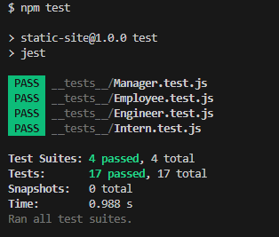

# Team Profile Generator 

## Description

The Team Profile Generator is a command-line application designed to streamline the process of creating a comprehensive HTML webpage that showcases the key information of your software engineering team.
This application simplifies the task by prompting the user to enter details for each team member, including Managers, Engineers, and Interns. The user is guided through a series of prompts, allowing them to input specific information based on the team member's role. Once all the necessary details are provided, the application dynamically generates an HTML page that neatly organizes and displays each team member's information.

This application utilizes Node.js and the Inquirer package to efficiently gather user input and Jest for testing to ensure the reliability of the generated HTML. With the Team Profile Generator, you can spend more time focusing on the development of your project while ensuring that your team's information is well-documented and easily accessible.

Image showing HTML page generated using Team Profile Generator application.

Image showing unit tests performed using Jest.

## Installation

To install the Team Profile Generator, follow these steps:

1. Clone the repository to your local machine.
2. Navigate to the project directory.
3. Run the command `npm install` to install the required dependencies.

## Usage

To use the application, follow these steps:

1. Open a terminal.
2. Navigate to the project directory.
3. Run the command `node index.js`.
4. Follow the prompts to enter information about your team members.

## License

This project is licensed under the MIT license.

## Contributing

Feel free to contribute to the success of this project. Follow these guidelines:

1. Fork the repository.
2. Create a new branch for your feature or bug fix.
3. Commit your changes.
4. Push to your branch.
5. Submit a pull request.

## Credits

The following articles and websites are used as references for this particular project.

[Professional README Guide](https://coding-boot-camp.github.io/full-stack/github/professional-readme-guide)

[Node.js](https://nodejs.org/en/learn/getting-started/introduction-to-nodejs)

[Jest Testing Framework](https://jestjs.io/)

[Inquirer Package](https://www.npmjs.com/package/inquirer)
